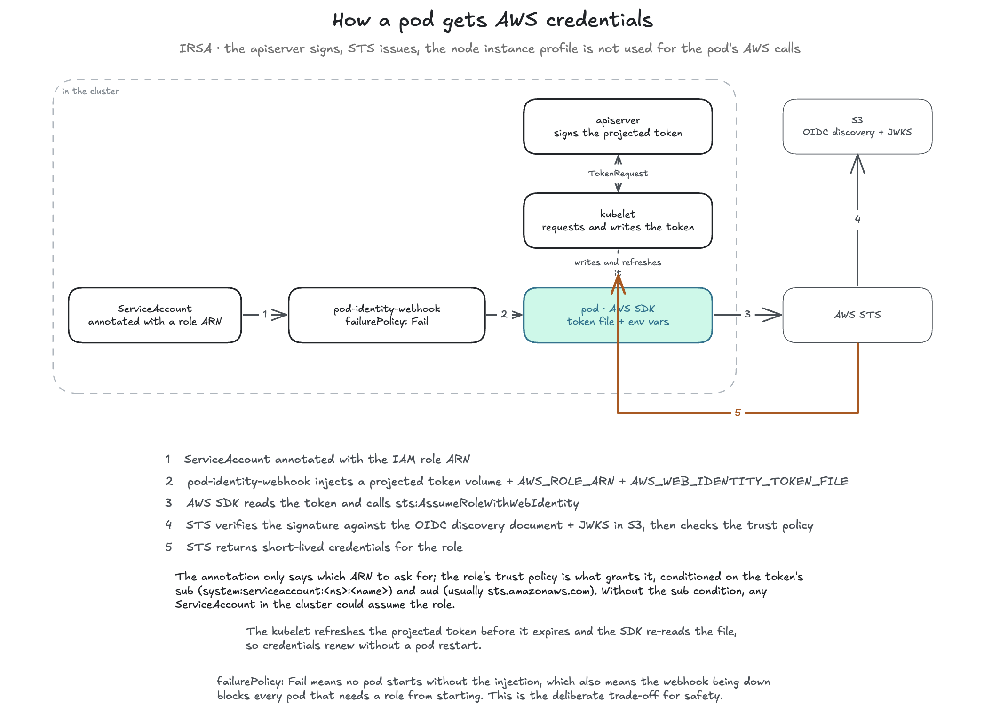
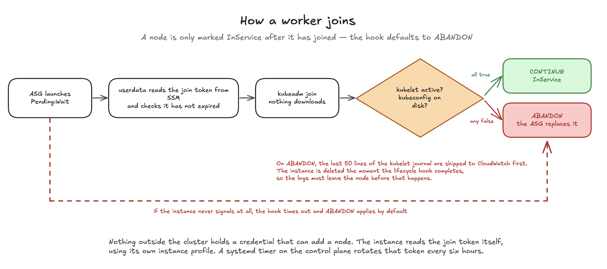
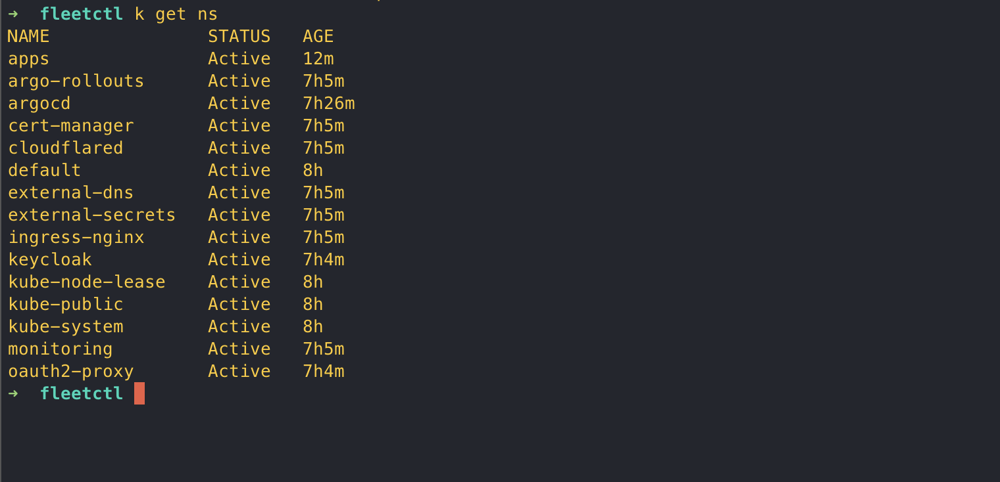
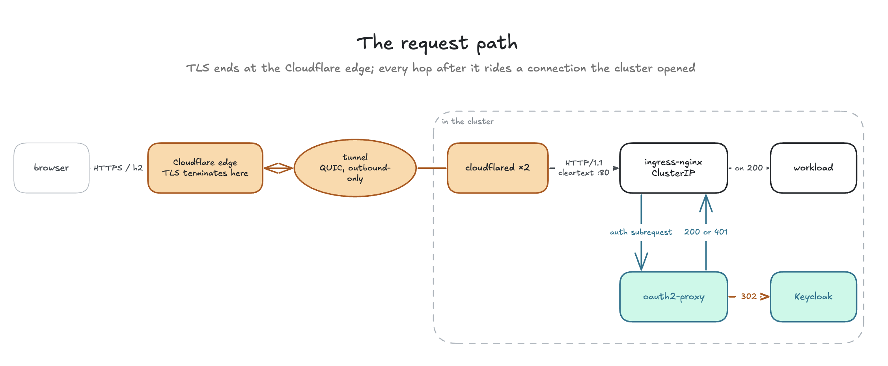
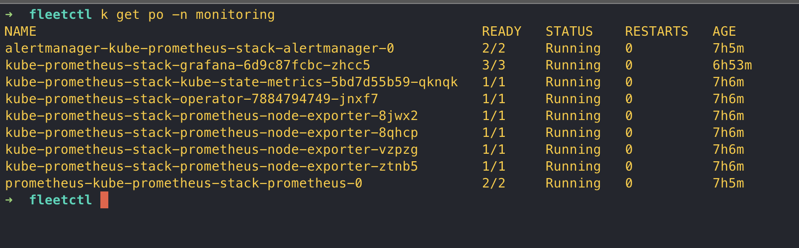
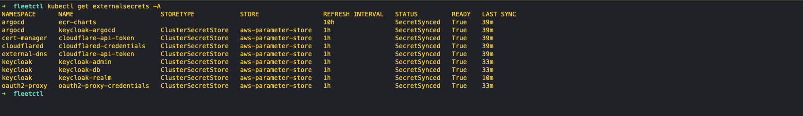
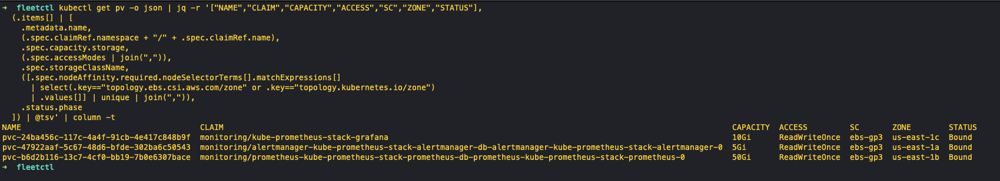

# Deep dives

Part 1 is the reasoning behind each design decision in the platform, in the same
order as the [README](../README.md). Part 2 is the incidents that changed that
design: what was observed, what was actually wrong, and the guard that followed.

Identifiers are placeholders: `<cluster>`.

---

# Part 1 — Decisions in depth

Three constraints shaped almost everything below, and they compound. The
apiserver has no public endpoint. Nothing may hold a long-lived credential.
Nodes have to join unattended, with nothing standing by to configure them.

Each is ordinary alone. Together they rule out most of the usual answers: an IAM
provider registered against the apiserver, a key in CI, a CI job or Ansible host
holding cluster credentials. What follows is mostly about what replaced them,
and what each replacement cost.

---

## 1 · IRSA for pods, instance profile for the node, OIDC for CI

A node's instance profile and IRSA both end in short-lived credentials issued by
AWS. What differs is whose they are.

### The boundary is the ServiceAccount, not the node

The alternative is to attach an IAM role to the node's instance profile and let
every pod inherit it. That is simpler, and it means a compromised pod, or any
pod that can reach the instance metadata service, holds the union of every
permission any workload on that machine needs. One container escape becomes the
whole node's role.

IRSA moves the boundary to the ServiceAccount, and issues nothing itself. A
ServiceAccount is annotated with a role ARN. The pod-identity-webhook mutates
the pod to add a projected service-account-token volume and the environment
variables the AWS SDK reads; the kubelet mints the token itself. The apiserver
signs it, which makes it a Kubernetes JWT and not an AWS credential, and the SDK
exchanges it through `sts:AssumeRoleWithWebIdentity`, where STS issues the
credentials.

Five hops, and the node's instance profile is not one of them:



The webhook runs `failurePolicy: Fail`, so a pod that should have received an
identity never starts without one rather than falling back to the node's. The
cost is availability: while the webhook is unreachable the apiserver rejects
every pod creation it matches, so rescheduling the webhook itself is a window in
which nothing new starts. That trade is right here, because a pod running
silently on the node's permissions is a security failure nobody notices, while a
pod that cannot start says so immediately.

Every trust policy pins exactly one `namespace:serviceaccount`. A wildcard `sub`
would mean anyone who can create a ServiceAccount can assume the role, giving
away the only thing the mechanism was adopted for:

```hcl
condition {
  test     = "StringEquals"
  variable = "${local.oidc_condition_prefix}:sub"
  values   = ["system:serviceaccount:${namespace}:${service_account}"]
}
```

Four roles use this: External Secrets, the EBS CSI driver, the AWS load balancer
controller, and Cluster Autoscaler. Everything else uses the node's instance
profile, for the reasons below.

### Publishing an issuer for a private apiserver

AWS trusts an _issuer_, and the issuer is the apiserver. To verify a signature
STS fetches the issuer's discovery document and keys from the public internet,
and this apiserver has no public endpoint, so registering it directly is
impossible. That is a constraint on delivery, not on the model: the apiserver
still signs, while an Ansible role copies the discovery document and JWKS to an
S3 prefix and registers _that_ URL as the IAM provider.

Every step of that role is an assertion, because each one corresponds to a
failure that is otherwise silent.

- It reads `--service-account-issuer` from the running apiserver manifest, not
  from the variables file. kubeadm supplies its own default, so an override that
  failed to apply would publish documents describing an issuer nothing uses, and
  the error would be `not authorized to perform sts:AssumeRoleWithWebIdentity`,
  naming neither URL.
- It asserts the served `jwks_uri` points at the bucket. Without
  `--service-account-jwks-uri` the document advertises a key endpoint on the
  private apiserver, STS follows it, and the exchange times out rather than
  failing. That is worse, because a timeout reads as a network problem.
- It verifies the upload by fetching it back over the public internet. A read
  from inside AWS succeeds even when the bucket policy is wrong, proving the
  upload worked while proving nothing about the only question that matters.

That issuer string is written in three places: the apiserver's own flags, the
Ansible role that publishes the documents, and the Terraform layer that
registers the provider. All three must agree byte for byte. IAM normalises the
URL, so a trailing slash produces a provider that never matches a token. A
Terraform precondition rejects one, and requires the URL to end with this
cluster's name. Copying a cluster directory and editing only the name would
otherwise leave every role trusting the _source_ cluster's tokens, a
cross-cluster privilege grant that no plan output shows.

The bucket is narrowly public: anonymous `GetObject` on two key patterns per
cluster, with an explicit `Deny` on anonymous `ListBucket`.

### Where a node instance profile is still correct

The instance profile is used where there is no ServiceAccount to scope to,
because the caller is not a pod:

- kubelet and containerd pulling images, which is why no workload here carries
  an `imagePullSecret`;
- userdata reading the join token and completing the lifecycle hook, which runs
  before the instance is a node at all;
- the join-token rotator, a systemd unit on the host;
- the SSM agent.

There is one exception. The AWS cloud-controller-manager runs as a pod and still
uses the node profile. It sets `providerID` and the zone label on every Node, so
it has to work before node initialisation completes, while IRSA depends on the
pod-identity-webhook, which is itself a workload delivered into a functioning
cluster. The CCM cannot depend on the mechanism it precedes.

The usual alternative for image pulls is a `dockerconfigjson` Secret rendered
from a base64 Helm value. It cannot work against ECR for longer than a day,
because the token behind it lasts twelve hours, so the Secret is stale by the
next morning. A real credential sits in git history either way.

### Two permission boundaries, not one

CI can create IAM roles. That is necessary, and it is the most dangerous grant
in the account, so the apply role may create roles under a specific path only
with a boundary attached. A compromised pipeline cannot mint an unbounded role
and write `Action: "*"` to it.

|        | Node boundary                                                                             | IRSA boundary                                                                                                                     |
| ------ | ----------------------------------------------------------------------------------------- | --------------------------------------------------------------------------------------------------------------------------------- |
| Path   | `/fleetctl/nodes/`                                                                        | `/fleetctl/irsa/`                                                                                                                 |
| Allows | SSM, scoped KMS, `PutMetricData`, ASG lifecycle, CCM describes, ECR pull, OIDC publishing | EC2 volume and security-group lifecycle, ELB, ASG desired capacity and instance termination, SSM read-only, ECR pull, KMS decrypt |
| Denies | `iam:*`, `sts:AssumeRole`, `organizations:*`, `account:*`                                 | the same, plus `ssm:PutParameter`, `ecr:PutImage`, and `s3:*` on the state and artifact buckets                                   |

An IRSA role capped by the _node_ ceiling would be denied every
`ec2:AttachVolume` call, and the symptom would be a CSI driver that installs
cleanly, reports healthy, and fails every attach with `AccessDenied`. The IRSA
ceiling also grants no Route 53 actions, and a boundary is a ceiling, so no IRSA
role in this account can hold Route 53 write at all, even if someone later
writes a policy granting it.

CI federates the same way into four roles: plan (read-only), apply (may create
IAM, only with the boundary), and two publishers scoped to one ECR prefix each.
Trust is pinned to `refs/heads/main`, never `pull_request`. Tags are immutable
on these repositories, so a fork PR able to assume a publishing role would
occupy a version number the platform trusts, permanently. Neither publisher
holds `DeleteRepository` or `BatchDeleteImage`.

---

## 2 · Workers join themselves

Nodes arrive and leave on their own schedule and nobody is present when they do.
There is no CI job or Ansible host holding cluster credentials, waiting to
configure them. A systemd timer on the control plane mints join credentials into
SSM, and a launching instance reads them with its own instance profile, then
runs `kubeadm join` against an image that already carries every binary and
container image the node needs.

Nothing in that path is optimistic. The lifecycle hook decides whether the
instance becomes a node, and it defaults to ABANDON:



### What decides that a node is needed

The obvious lever is a CloudWatch scaling policy on CPU, and it is the wrong
signal. Kubernetes schedules on requests while CloudWatch reports usage, so a
node whose CPU is fully requested but barely used looks idle to the group.
Nothing is added, and pods sit Pending against a cluster that reports plenty of
headroom.

Cluster Autoscaler asks the scheduler instead. It watches for pods that cannot
be placed, simulates whether a node of a group's shape would take them, and
raises that group's desired capacity if it would. Nothing in the join path
changes: the launch template, the baked AMI, the userdata and the lifecycle hook
are untouched, and the autoscaler only moves a number.

Which group the autoscaler scales is the other half of the design. Persistent
volumes are zonal: a volume in one availability zone is only usable by a pod on
a node in that zone. A single Auto Scaling group spanning three zones knows
nothing about that and replaces instances wherever it likes. It once emptied a
zone, and every volume in that zone became unschedulable for three hours.

So workers run in three Auto Scaling groups, one per availability zone, each
pinned to that zone's subnet with a floor(min_size) of one. That makes per-zone capacity
impossible to lose by accident rather than something a controller has to keep
getting right, and it makes `AZRebalance` moot, since a group pinned to one
subnet has nothing to rebalance.

The autoscaler holds a fourth IRSA role, and the IRSA permission boundary had to
be widened for it. A boundary is a ceiling, so without
`autoscaling:SetDesiredCapacity` and `TerminateInstanceInAutoScalingGroup` in
the boundary the role is denied regardless of its own policy, and the symptom is
an autoscaler that installs cleanly, reports healthy, and never scales anything.

### InService has to mean joined

The lifecycle hook holds a launching instance in `Pending:Wait`, and its
`default_result` is ABANDON. That single setting turns a failed join from "an
instance that is not a node, and nobody notices" into an abandoned instance the
ASG replaces.

CONTINUE is signalled only after two things are proved: kubelet is active, and
`/etc/kubernetes/kubelet.conf` exists on disk. Proof, not optimism. A `kubeadm
join` that exited zero is not the same claim.

### Leaving has to be as deliberate as joining

An ASG scaling in picks an instance by termination policy and terminates it. The
kubelet dies with the machine, so pods get no graceful shutdown, and the Node
sits `NotReady` long enough for endpoints to keep routing to pods that are
already gone.

Cluster Autoscaler's own scale-down does this properly: cordon, drain, respect
PodDisruptionBudgets, then terminate through the ASG API. A drain is only as
good as those budgets, so the singletons carry them. Without one, eviction takes
every replica at once and the graceful path ends up no better than the abrupt
one.

Scale-down is also more conservative than it first appears. A node holding a pod
with no controller behind it, a pod using local storage, or a pod under a budget
that cannot be satisfied will not be removed at all, and nothing reports that it
was considered and declined.

Cluster Autoscaler only drains what it decides to remove. A health-check
replacement, a manual termination or a spot reclaim are not its decisions, and
on those paths a node still leaves without being emptied. Closing that needs a
`Terminating:Wait` hook plus something to complete the lifecycle action, and
node-termination-handler reads ASG lifecycle events only in queue-processor
mode, which means an SQS queue, EventBridge rules and another role. Adding the
hook without the handler would be worse than adding neither. The hook holds
every terminating instance until its timeout elapses, an hour by default, so a
node that takes seconds to go would take an hour instead. Both halves land
together or neither does.

### Diagnosis has to outlive the instance

Userdata tees to a local log, but that disk dies with the machine. A failed join
ships the last fifty lines of the kubelet journal to CloudWatch _before_ calling
`complete-lifecycle-action`, because the ASG terminates the instance the moment
that call returns. It has to come first, and it has to be bounded: a shipment
that hangs would hold the instance in `Pending:Wait` until the hook expires,
which is a slower version of the same failure.

`make join-failures` reads those diagnostics back with one command, against a
set of instances that no longer exist.

### Sixty-five seconds, and where they go

An Ansible-driven join took twelve minutes. This is the measurement that
replaced it, and the part of it that belongs to AWS rather than to anything in
these repositories.

Three worker nodes were terminated through the Auto Scaling API, one in each
zone, and left to come back unattended. Instance type `m7i-flex.large`, all
three in the same account and region.

Two clocks matter and they measure different things. One is what an operator
waits through, from the terminate call to a node reporting Ready. The other
starts once EC2 has a machine running, and it is the only span any decision
here can change. Both are below, so the line between them is visible rather
than asserted.

#### What an operator waits through · mean 129 s

| zone       | terminate | instance running | join starts | join done | Ready    | **total** |
| ---------- | --------- | ---------------- | ----------- | --------- | -------- | --------- |
| us-east-1a | 20:35:42  | 20:37:08         | 20:37:33    | 20:37:56  | 20:38:09 | **147 s** |
| us-east-1b | 20:33:22  | 20:34:40         | 20:35:04    | 20:35:23  | 20:35:27 | **125 s** |
| us-east-1c | 20:35:57  | 20:37:09         | 20:37:31    | 20:37:48  | 20:37:53 | **116 s** |

About 80 seconds of every one of those belongs to AWS: the Auto Scaling group
noticing the instance is gone, then EC2 building a replacement. That portion
alone varied by 14 seconds across three identical calls, and nothing in this
repository shortens any of it.

#### What the platform controls · mean 51 s

This span begins when EC2 reports the instance running and ends when the
apiserver marks the node Ready.

| zone       | boot → join starts | `kubeadm join` | join → Ready | **total** |
| ---------- | ------------------ | -------------- | ------------ | --------- |
| us-east-1a | 25 s               | 23 s           | 13 s         | **61 s**  |
| us-east-1b | 24 s               | 19 s           | 4 s          | **47 s**  |
| us-east-1c | 22 s               | 17 s           | 5 s          | **44 s**  |

Around twenty of those seconds are `kubeadm join`, and they are short because
the join downloads nothing: every binary and container image is already on the
disk. The rest is the machine coming up.

The published figure is 65 s, it is the slowest of these three rounded up, not their
mean of 51s. The twelve minutes it replaces was measured the same way, from a
machine that was already running, so the two compare directly.

---

## 3 · The join token is rotated on a timer and monitored by its absence

A worker that joins itself needs a credential, and a credential that never
expires is not a credential. So one is minted on a schedule, with enough overlap
that a missed run is survivable: a 24-hour token, rotated every 6 hours. The
timer has to fail four consecutive times before any worker can find an expired
one.

The unit carries `Persistent=true`, so a control plane stopped for longer than
the interval fires on boot rather than waiting out another full period. Without
it, a machine switched off overnight comes back holding an expired token and
nothing can join.

Each run publishes three parameters: the token as a SecureString, its expiry,
and the CA certificate hash. The hash goes out every run rather than once, so a
CA rotation cannot leave a stale value behind.

### Failing loudly left nothing to hear

Aborting on a bad value trades a silent wrong value for a silent stopped
mechanism. Workers keep joining on the last good token, and then every
replacement fails simultaneously, up to a day after the breakage.

So the rotator publishes seconds-remaining only on the success path, as the very
last statement, and the alarm treats missing data as breaching. Because the
publish is last, an abort at any earlier guard emits nothing: one alarm covers
the timer being stopped, the unit failing, the script's own guards tripping, IAM
being wrong, and the control plane being gone. The alarm watches for the absence
of a success signal rather than the presence of a failure one, because a
component that has stopped cannot report that it stopped. The value also carries
freshness, which catches the subtler case: rotation running, but minting tokens
that expire too soon.

### The timing is the design

The alarm runs on a 6-hour period over two evaluation periods, so it fires
roughly twelve hours after the last success, leaving roughly twelve hours before
the last good token expires. Two consecutive empty periods cannot arise from
timer drift, because `OnUnitActiveSec` measures from run _completion_. The
metric uses a custom namespace for an unglamorous reason: AWS does not allow
`cloudwatch:PutMetricData` to be scoped by resource, so a custom namespace is
the only thing an IAM condition can scope on.

---

## 4 · Terraform state split by lifecycle, with the cluster as the unit of blast radius

Two questions decide the whole layout: what should one mistake be able to
destroy, and what should have to change together.

The cluster is the unit of blast radius. The directory is
`clusters/prod-use1-01/`, never `environments/prod/`. Environment is a name
prefix and a tag, not a directory level. No workspaces, no `-var-file`
promotion. A new cluster is a copied directory reviewed as a diff of literal
values, and no root module can address another cluster's state. That trades
elegance for reviewability on purpose: a `-var-file` scheme is smaller, but it
makes every environment a runtime argument, and the failure mode is applying
staging's plan to production with no diff that shows it.

Lifecycle is the unit of state isolation. State is split by how often a thing
changes rather than by what kind of thing it is. Six state files per cluster
means a worker-count typo cannot produce a plan that replaces a subnet. The
corollary is that the layer which runs most often has the least power:
`040-inventory` holds rendered files and a guard marker, and no infrastructure,
so a careless `destroy` there deletes regenerable objects rather than a subnet.

### Facts flow up; addresses are discovered live

Upper layers read lower ones with `terraform_remote_state`, but only for
_facts_: CIDRs, subnet IDs, expected counts, the API name. _Addresses_ that
churn come from tag-filtered data sources in whichever layer needs them. That is
why the inventory layer re-renders current truth with one apply, and why adding
a node pool requires no change to it.

It also imposes a rule. `terraform_remote_state` reads a whole state file rather
than its outputs, so lower layers have to stay secret-free. The inventory
layer's discovery carries a postcondition on the count it finds, because a short
inventory is worse than no inventory: Ansible would happily run against it.

### Why `018-data` sits below the control plane

`018-data` holds RDS and the credentials that outlive the cluster, and its
number encodes lifecycle, not dependency. No layer reads its state. Its outputs
are SSM parameter names, and their consumer is External Secrets inside the
cluster. Like `010-network`, it is numbered low because it survives a teardown,
and it is excluded from `apply-all` so a routine apply can never touch the
database.

Keycloak's realms, clients and users live there precisely because wiping
Kubernetes off the nodes is a routine operation rather than an emergency. An
in-cluster database would mean a rebuild silently loses every identity unless
backups exist _and_ someone has restored one.

This has been exercised rather than assumed: the cluster was deliberately
destroyed, and RDS, the VPC, both AMIs and the registry survived it. The realm,
with its clients, groups, scopes and hardening, came back untouched.

### What the guards refuse

Forty-eight preconditions and validations across fifteen files. The five that
refuse the most interesting things:

| Refuses                                                            | Why                                                                  |
| ------------------------------------------------------------------ | -------------------------------------------------------------------- |
| `control_plane_count != 1` while no apiserver load balancer exists | round-robin DNS with no health awareness; clients cache the dead one |
| more control-plane nodes than AZs                                  | they would share an AZ, so losing it loses etcd quorum               |
| an OIDC issuer not ending in this cluster's name                   | a copied directory would trust the source cluster's tokens           |
| AMI versions of `latest`, `stable`, or a bare version number       | not pinnable, and a bare version is not unique across rebuilds       |
| AZs not available in this account and region                       | fails at plan time rather than mid-apply                             |

Pod and service CIDRs are registered in a fleet-wide table too, not just VPC
CIDRs. They are invisible to AWS, so nothing stops two clusters both using
`10.100.0.0/16`. It works until a Transit Gateway joins them, at which point pod
traffic blackholes with no error anywhere.

---

## 5 · Argo CD is installed once, then manages itself

Everything in the cluster is delivered by Argo CD from git, but Argo CD itself
has to arrive somehow, and it cannot install itself. Something outside git has
to break that cycle exactly once.

Ansible does it: a minimal Helm install, then a single root Application pointing
at a directory in the gitops repository. That directory is an app-of-apps, one
Application per platform component, and one of those components is Argo CD. From
the first sync onward it reconciles its own manifests from git alongside
everything else, and the Ansible install has no further role.

The bootstrap is guarded on the root Application not yet existing. That guard is
necessary because Argo CD renders Helm with `helm template` and creates no Helm
release, so the release Ansible made is vestigial the moment git takes over. An
unguarded re-run would revert Argo CD to bootstrap-minimal values until git
reasserted itself. Bootstrap is a one-time operation; running it twice must be a
no-op, not a flap.

The role asserts a worker exists first, because Argo CD pods would otherwise
stay `Pending` forever on a tainted control plane. It rejects `x` or `*` in the
chart version. And it treats a sync status of `Unknown` as fatal rather than
still-progressing, because an Argo CD that cannot reach git reports `Unknown`,
which otherwise looks exactly like a clean install.

### Platform Applications versus an ApplicationSet

Templating pays where instances are uniform and numerous, and costs where they
are few and each is special. The platform components are each special, with
different charts, different sync options and different `ignoreDifferences`, so
each gets its own Application. The workload services have far more in common
than not, so they are generated by an ApplicationSet from per-service,
per-environment intent files matched against clusters by label, with
`missingkey=error` so an incomplete intent file fails loudly.

### Three conventions that are load-bearing

**No `resources-finalizer` on platform Applications.** An upstream chart's CRDs
cannot be annotated `Prune=false`, because that metadata belongs to the chart,
not to the platform. What is controlled is whether the Application cascades on
delete. Without the finalizer, deleting the cert-manager Application _orphans_
its CRDs and every Certificate rather than destroying them. That is the
recoverable direction.

**`ServerSideApply=true` on anything carrying CRDs.** The prometheus-operator
and Argo CD CRDs exceed the 262144-byte `last-applied-configuration` annotation
limit, and client-side apply fails outright rather than degrading. Never
`Replace=true`, which is delete-then-create and takes every custom resource with
it.

**Exact chart versions, never ranges.** A range means what runs depends on when
Argo CD last synced rather than on what is in git, which makes "what changed?"
unanswerable after an incident. CI rejects one.

Twenty Applications, every chart version a literal.


And the namespaces they bring with them:



---

## 6 · Ingress through a Cloudflare Tunnel, so there is no inbound path

`cloudflared` runs in-cluster and dials _out_; requests return over that
established connection. There is no inbound path, no public origin to find or
port-scan, and no Cloudflare IP allowlist to maintain. That allowlist would
otherwise be mandatory, because an internet-facing load balancer is reachable by
anyone who resolves its AWS hostname, which makes the proxy in front of it
decorative.

### cloudflared terminates; it does not pass through

This is the easiest thing here to get wrong, and three separate bugs came from
assuming otherwise. A browser negotiates TLS 1.3 and HTTP/2 with Cloudflare;
nginx receives HTTP/1.1 in cleartext. A passthrough cannot downgrade a protocol
version or strip TLS, so the request is demonstrably parsed and re-issued.



Three things downstream follow from it.

**`use-forwarded-headers` is load-bearing.** nginx's own connection is always
plain HTTP, so without it every `force-ssl-redirect` finds the scheme to be
`http` and redirects genuine HTTPS traffic to itself, forever.

**Keycloak's hostname is pinned, not derived.** The request arrives on port 80
carrying `X-Forwarded-Proto: https` and `X-Forwarded-Port: 80`, each true of the
last hop and neither true of the public URL. Keycloak combined them into
`https://host:80/` in its issuer, and oauth2-proxy refused it.

**`auth-url` points in-cluster while `auth-signin` points at the public URL.**
`auth-url` is a subrequest nginx makes on _every_ request; sending those to the
edge would add a WAN round trip per page load and make the monitoring stack
unreachable whenever the tunnel was down.

### Authentication is per-host, with one deliberate exemption

Prometheus and Alertmanager have no authentication of their own. Not weak
authentication, none. Alertmanager routes to Slack and email, and anyone who
reaches it can silence any alert, which is the quietest way to disable
monitoring.

Two controls cover them. oauth2-proxy forward-auth gates the public path, and a
CI check fails the build if an Ingress on those hosts is missing either
annotation, because forgetting one is silent: the site simply works, for
everyone. But forward-auth only covers requests that arrive through nginx, and
nothing stops a pod in the cluster dialling the Service directly. A
NetworkPolicy closes that path as well.

Grafana, Prometheus and Alertmanager each carry one, and what they buy is worth
stating precisely rather than generally. Grafana's and Prometheus's admit any
pod in the `ingress-nginx` or `monitoring` namespaces, which narrows the
reachable set rather than isolating them. Alertmanager's is tighter:
ingress-nginx pods in the `ingress-nginx` namespace on 9093, and from
`monitoring` only Prometheus and the config reloader, on named ports.

Grafana additionally runs `auth.proxy`, so one sign-on serves both rather than
showing its own login form afterwards. That means trusting an identity header,
which is only safe while nginx is the sole thing that can reach it. Verified
from a pod in another namespace with a forged header.

The three policies are not written the same way, for a reason worth recording.
Alertmanager uses the chart's own NetworkPolicy. Prometheus cannot: that
template hardcodes `policyTypes: [Egress, Ingress]` and emits egress rules only
when they are supplied, so switching it on with no egress block denies every
scrape, and the symptom is a monitoring outage rather than anything naming a
policy. Prometheus gets a hand-written ingress-only policy instead.
Alertmanager's tightness comes from putting its namespace and pod selectors in
one `from` element, so it matches on both rather than either. Set only one of
the two and the rule renders empty and locks nginx out, silently.

What the three policies are protecting: Prometheus and Alertmanager on zonal
volumes, Grafana behind `auth.proxy`, and an exporter on every node.



Argo CD is exempt, and the exemption is asserted in code. Its UI speaks gRPC-Web
and its CLI speaks gRPC, while forward-auth answers an unauthenticated request
with a 302 to an HTML login page, which the CLI cannot follow. It authenticates
against Keycloak directly. The exemption is listed explicitly in the check so it
reads as a decision rather than an oversight.

### Going back to an NLB

Seven steps, preceded by a probe, and the ordering is the whole value.

0. **Probe first.** One `create-load-balancer` call against a throwaway name,
   then delete it. A migration that starts by deleting the current path should
   not discover its replacement is unavailable halfway through.
1. **Restore TLS on every Ingress, first.** Some blocks can be recovered from
   git history and the rest never had one. Steps 2 to 4 alone would serve
   `CN=Kubernetes Ingress Controller Fake Certificate` to the public.
2. Restore `service.type: LoadBalancer`, internet-facing, with Cloudflare's IPv4
   ranges allowlisted. IPv6 is excluded deliberately: including it silently
   breaks the whole reconcile.
3. Wait for the load balancer and for healthy targets.
4. Drop `--default-targets` from external-dns. `policy: upsert-only` means
   records are updated in place and never deleted.
5. Set Cloudflare SSL mode to Full (Strict), and only once step 4 has DNS
   pointing at the new load balancer. Until then Cloudflare sits in Full mode,
   which accepts any origin certificate including a self-signed one.
6. Remove the tunnel. This removes the fallback, so it is last.
7. Clean up the Cloudflare-side tunnel and the SSM credentials parameter.

An NLB is the better choice when a hard Cloudflare dependency for all ingress is
unacceptable, when a second cluster needs the same ingress and the manual tunnel
setup should become a Terraform layer rather than be repeated, or when raw TCP
or non-HTTP protocols are needed, which a tunnel serves poorly.

---

## 7 · etcd as a systemd unit, not a static pod

kubeadm's default is to run etcd as a static pod, and Kubespray's default is not
to. Keeping the host deployment is a choice about what can be guaranteed before
etcd starts, and about what remains possible once it has stopped.

### The mount window

The etcd EBS volume is in fstab with `nofail`, deliberately, so a volume
attaching slowly, or not at all, cannot hang the boot. That buys availability
and opens a hole: if the volume is not mounted, `/var/lib/etcd` is an ordinary
directory on the root disk, and etcd will start on it and begin writing. No
error anywhere. The result is a member with no history, or a second copy of the
data on the wrong disk.

`RequiresMountsFor=/var/lib/etcd`, installed as a systemd drop-in, closes it:
systemd resolves that path to its mount unit and refuses to start `etcd.service`
until the mount is active.

That directive exists only in systemd's dependency model. A kubeadm static pod
is managed by the kubelet, which will not refuse to start a pod because a
`hostPath` turned out to be an empty directory. The guard is _unavailable_ in
the static-pod design, not merely less convenient.

### What else the host deployment buys

**etcd stops depending on the kubelet.** As a static pod, etcd's availability is
gated on kubelet health, while the apiserver needs etcd and the kubelet needs
the apiserver for everything beyond static pods. Host etcd cuts that knot.

**A working lever during recovery.** Restoring from a snapshot is: stop the
unit, replace the data directory, start the unit. With a static pod it is edit a
manifest and wait for the kubelet to notice, and if the kubelet is what is
broken, there is no lever at all. That is precisely when it is needed.

**systemd's primitives apply:** ordering, restart policy, resource accounting,
and a journal that survives independently of container runtime state. etcd's
version also decouples from the kubeadm and kubelet upgrade cycle.

### The cost, and why it is asserted

etcd is no longer visible as a pod, so anything reaching for `kubectl get pods
-n kube-system` to check it needs rethinking, and the binary's lifecycle belongs
to the host.

`host` is already Kubespray's own default, so this is pinned rather than
overridden, written down explicitly so a submodule bump cannot float it. The
role also _asserts_ the value before installing the drop-in, because a drop-in
on `etcd.service` against a static-pod deployment is a silent no-op: the guard
would appear installed and do nothing. A guard that can quietly fail to apply is
worse than no guard, because it is trusted.

Preflight independently asserts `mountpoint -q /var/lib/etcd` before Kubespray
runs. The bootstrap marker only proves userdata finished once, and `nofail` can
still leave a root-disk directory after a later reboot.

---

## 8 · The apiserver is addressed by name, never by IP

The record is `api.<cluster>.fleetctl.internal` in a private hosted zone, TTL
60, pointing at the control plane's private IP. There is deliberately no load
balancer behind it.

The reason it is a name rather than an IP is not indirection for its own sake.
The FQDN is what lives in the apiserver certificate SANs
(`supplementary_addresses_in_ssl_keys`), so the name does not change when the
topology does, only what it resolves to. Promoting from one control plane to
three repoints a record and requires standing up an apiserver load balancer,
which a precondition enforces. What it does not require is regenerating
certificates or re-imaging nodes.

It is natural to assume that an apiserver load balancer is what protects
certificates across an HA promotion. It does not. A load balancer gives
health-aware routing and does nothing whatsoever for the certificate; the FQDN
in the SANs does that, whether the name resolves to an NLB or to a node's
private IP. Getting this backwards means believing the promotion is blocked on
infrastructure that is not actually load-bearing for it.

The same name is consumed in four places: the SSM parameter a self-joining
worker dials, kubeadm's `JoinConfiguration`, the Kubespray inventory, and the
certificate SANs. That is why Terraform owns it, with one layer computing it and
everything else reading it. A precondition refuses a second control plane while
no apiserver load balancer exists, because two A records on one name is
round-robin DNS with no health awareness, and clients cache the dead one.

The cost is that DNS is now in the join path, so a wrong record breaks every new
node. That is why the record is owned by Terraform and derived from one place
rather than written by hand.

---

## 9 · One secret backend: SSM Parameter Store, delivered by External Secrets

External Secrets reads from this account's SSM Parameter Store, not from Secrets
Manager, which is what most reference architectures use. The platform already
keeps the join token, the AMI pins and the gitops deploy key in SSM, and a
second backend would mean two IAM shapes, two rotation stories and two places to
look. The consolidation is worth more than any individual feature difference,
because the failure mode of two backends is someone checking the wrong one
during an incident.

Authentication is IRSA: the External Secrets ServiceAccount is annotated with a
role whose trust policy pins this cluster's issuer and that exact
ServiceAccount. No access key exists.

Nine secrets, six namespaces, one `ClusterSecretStore` behind all of them.



**The cost.** Every generated credential is _also_ in Terraform state, in
plaintext. That is true of every generated credential in every Terraform
codebase; the question is what answers it. Today the answer is containment:
state lives in an S3 bucket with SSE-KMS enforced by bucket policy and public
access blocked, and lower layers are kept secret-free because
`terraform_remote_state` reads a whole state file rather than its outputs.

Containment is the weaker answer. The stronger one is to keep the value out of
state entirely, and these layers already run a version that supports it:
write-only arguments such as `value_wo` on `aws_ssm_parameter` and `password_wo`
on `aws_db_instance`, plus ephemeral values, none of which are persisted to
state or to plan output. That turns the exposure into a non-event rather than
something a bucket policy has to contain.

**One shape to avoid.** The tempting way to deliver the Argo CD OIDC client
secret is to merge it into Argo CD's own Secret with `creationPolicy: Merge`. It
works, and it leaves that Secret permanently OutOfSync, because External Secrets
stamps the target with its own metadata, so a Helm-owned Secret starts claiming
to be an ExternalSecret belonging to a different Application and Argo CD reports
drift forever. The fix is a standalone Secret referenced explicitly. `Merge` is
for adding to something nobody else reconciles.

---

## 10 · Two ECR mechanisms, because there are two different consumers

**The kubelet pulls container images.** Kubernetes removed the in-tree ECR
credential provider, so a node with a perfectly scoped instance profile still
cannot pull. It needs the out-of-tree binary, a config file, and a kubelet
_flag_. `imageCredentialProviderConfigFile` is a flag, not a
KubeletConfiguration field, so putting it in the config file is accepted in
silence and does nothing. All three are baked into the AMI and asserted by a
check on the built image.

Two details about the bake are easy to miss. The binary is built from pinned
source and staged in S3, because the upstream project publishes no release asset
for it. And the release cache was moved off `/tmp`, because `systemd-tmpfiles`
ages `/tmp` out, so a baked cache there would decay and the downloads would
quietly start happening again at boot.

**Argo CD pulls Helm charts.** An ECR authorization token lasts twelve hours, so
this cannot be a static Secret. Creating one at bootstrap would work for a
single working day, and then Argo CD would stop syncing every ECR-sourced
Application with a registry auth error that reads like a network problem. An
External Secrets `ECRAuthorizationToken` generator mints one, refreshed every 10
h rather than 11h59m, because a refresh that fails once must still have room to
succeed on retry.

The generator carries no `auth` block, deliberately: with none it uses the
credentials of the External Secrets _controller pod_, whose ServiceAccount
already holds the IRSA role. The obvious alternative does not work, and the
reason is easy to miss. A `serviceAccountRef` in a _namespaced_ generator is
resolved in the generator's own namespace, so naming a ServiceAccount in another
namespace buys nothing, and the error names the ServiceAccount without naming
the namespace it actually searched. Cross-namespace `serviceAccountRef` is
honoured only by cluster-scoped resources.

The cost is maintaining two mechanisms where one registry credential would have
been simpler. The consumers genuinely differ: one is a node process that must
work before any workload exists, the other a workload that must keep working for
longer than a single token lives.

---

## 11 · Human access is SSM Session Manager only

There is no bastion host and no durable key. Access to every node is
`AmazonSSMManagedInstanceCore` on the instance profile, and the apiserver is
reached by port-forwarding over that session.

The SSM tunnel is transport, not authentication. `AWS-StartSSHSession` forwards
TCP to port 22, and sshd still wants a credential, so `ssh_config`'s
ProxyCommand pushes an EC2 Instance Connect key with a 60-second TTL before
opening the tunnel, and nothing persists in `authorized_keys`. The key is an
operator credential rather than cluster state: `make setup` generates it, it
lives in `$HOME`, and it is never committed anywhere.

What that removes: a long-lived private key that can be copied, an open port 22,
a bastion instance to patch and pay for, and a security group rule maintained as
people's addresses change. What it adds: IAM-governed access, auditable in
CloudTrail per session, with no key distribution story at all.

It costs latency on every connection, and a dead tunnel looks exactly like a
dead cluster. That is a real diagnostic hazard, and the reason `make ping`
exists as a distinct step before anything that touches the cluster.

---

# Part 2 — Incidents that changed the design

Each of these ends in a mechanism rather than a one-off fix. They are here for
what they have in common: none announced itself where it happened. The symptom
surfaced in a different component, arrived hours after the cause, or never
arrived at all. One of them was caused by the fix for the one before it. These
are the failures that appear only where systems meet, which is why no
component's own tests catch them.

Each entry runs the same way: what was observed, what was actually wrong, what
changed, and the guard that now stops that class of failure recurring unnoticed.

---

## 1 · The rotator published a token that had already expired

**Symptom.** None at all. Rotation reported success on every run, the SSM
parameters existed, and their contents were well-formed.

**Root cause.** The expiry line ended in a fallback:

```
date -u -d "+${TTL%h} hours" +%Y-%m-%dT%H:%M:%SZ || date -u +%Y-%m-%dT%H:%M:%SZ
```

The fallback was there for the ordinary reason fallbacks are there, so that a
formatting failure would not abort a credential rotation. But when the primary
expression was rejected, the substitute was the current time, so the published
expiry was already in the past the instant it was written. Every downstream
reader saw a value that was present, correctly shaped, and wrong.

**Fix.** The fallback is gone. The script now computes the expiry or fails, and
asserts the result lies in the future before publishing anything.

**The guard it produced.** One check was not enough, because a script verifying
its own arithmetic proves only that the arithmetic ran. The Ansible role now
reads the parameter back on the node, after the write, and asserts the expiry is
still in the future at apply time: a second observer, on the other side of the
publish.

---

## 2 · A safety fix made a stopped rotator look healthy

**Symptom.** None, and that is the incident. Every worker replacement would have
failed at once, up to twenty-four hours after the breakage, with no signal in
between.

**Root cause.** Incident 1's fix. Once the rotator refused to publish a bad
value, it published nothing instead, and a rotator publishing nothing is
indistinguishable from one that has not needed to run. Workers keep joining on
the last good token right up until it expires, so the system looks healthy for
as long as that token lasts and then fails everywhere simultaneously. Failing
closed removed a wrong answer and left a silence in its place.

**Fix.** The rotator publishes a CloudWatch metric carrying seconds-until-expiry
only on the success path, as the very last statement in the script, and the
alarm treats missing data as breaching.

**The guard it produced.** Because the publish is last, an abort at any earlier
point emits nothing, so one alarm covers five distinct failures: the timer
stopped, the unit failed, the script's own guards tripped, IAM broke, or the
control plane is gone. None of them can fake a healthy signal, because the
signal is not a value but the arrival of one.

The arithmetic is the rest of the design. A 24-hour token on 6-hour rotation
means four consecutive failures before any worker is affected. A 6-hour alarm
period over two evaluation periods fires roughly twelve hours after the last
success, leaving roughly twelve hours before the last good token expires. Two
consecutive empty periods cannot arise from timer drift, because
`OnUnitActiveSec` measures from run _completion_.

---

## 3 · Every new worker failed to join, and nothing said why

**Symptom.** Worker joins died at about four and a half minutes. The join log
ended:

```
[kubelet-start] Starting the kubelet
[kubelet-check] Waiting for a healthy kubelet at http://127.0.0.1:10248/healthz.
                This can take up to 4m0s
```

Nothing else. The instance was terminated seconds later.

**Root cause.** Only the kubelet's own journal named it:

```
unable to load client CA file /etc/kubernetes/ssl/ca.crt: no such file or directory
```

| Setting                                     | Value                        |
| ------------------------------------------- | ---------------------------- |
| `kubelet-config` ConfigMap → `clientCAFile` | `/etc/kubernetes/ssl/ca.crt` |
| `kubeadm-config` → `certificatesDir`        | `/etc/kubernetes/ssl`        |
| where `kubeadm join` actually wrote the CA  | `/etc/kubernetes/pki/ca.crt` |

Kubespray sets `kube_cert_dir` to `{{ kube_config_dir }}/ssl`, and that path is
baked into the cluster-wide kubelet ConfigMap that every joining node downloads.
But `kubeadm join` defaults its own `caCertPath` to `/etc/kubernetes/pki/ca.crt`
and does not derive it from the `certificatesDir` in the config it just fetched.
The kubelet could not load its client CA, exited, and systemd restarted it
forever; kubeadm waited out its full four-minute health timeout; the lifecycle
hook abandoned; the ASG deleted the instance.

**Fix.** Pinned in the `JoinConfiguration` Terraform renders:

```yaml
apiVersion: kubeadm.k8s.io/v1beta4
kind: JoinConfiguration
caCertPath: /etc/kubernetes/ssl/ca.crt
```

**The guard it produced.** Two places must agree on `kube_cert_dir`. That
agreement could be published at runtime, or checked statically. The static check
won for three reasons: it fails on a laptop in milliseconds rather than four
minutes into a production replacement; changing `kube_cert_dir` means rebuilding
cluster PKI, so it is not a quiet edit; and it keeps the token rotator
single-purpose instead of making a six-hourly credential timer responsible for a
fact that never changes.

Userdata also now ships the last fifty lines of the kubelet journal _before_
abandoning. Failure diagnosis must survive the thing that failed.

---

## 4 · Self-joined workers served certificates the apiserver refused

**Symptom.** `kubectl logs` against any worker failed with `x509: certificate
signed by unknown authority`, and metrics-server failed its readiness probe.
Neither symptom mentions kubelet configuration.

**Root cause.** Kubespray writes `serverTLSBootstrap` into a node's _local_
kubelet config. A worker that self-joins via kubeadm never runs Kubespray, so it
never received that setting and generated a self-signed serving certificate. The
apiserver refused it, because Kubespray configures the apiserver with
`--kubelet-certificate-authority`, which makes it strict about what it accepts.

There is a second trap underneath. Two kubelet config files exist and only one
counts: kubeadm's systemd drop-in clears `ExecStart` and sets its own using
`--config=/var/lib/kubelet/config.yaml`, so on a kubeadm-bootstrapped cluster
Kubespray's file is dead config. Confirmed by reading the running process's
command line rather than by assuming.

**Fix.** A role patches the setting into the cluster-wide `kubelet-config`
ConfigMap that every `kubeadm join` downloads, as a JSON patch replacing the
parsed YAML rather than a wholesale apply that would drop sibling keys. It also
repairs the control plane's own local config, since that node joined itself
before the ConfigMap was patched, then proves the result:

```
openssl x509 -in /var/lib/kubelet/pki/kubelet-server-current.pem \
  -noout -issuer -checkend 0
```

**The obvious fix would have been a slow regression.**
`--rotate-server-certificates` in the worker's `kubeletExtraArgs` solves the
immediate symptom, and is marked DEPRECATED in favour of exactly this config
field, so it would have worked until the flag was removed and then failed the
same way again, with the original diagnosis buried a year deep.

**The guard it produced.** Cluster-wide settings are delivered through the
ConfigMap every join downloads, never through a node's local file, and the role
proves the certificate's issuer rather than assuming the patch landed. Verified
by replacing a worker: the replacement came up with the setting already present
and a certificate issued by the cluster CA, with no manual step.

---

## 5 · An Auto Scaling group emptied a zone and stranded every volume in it

**Symptom.** Pods with existing PersistentVolumeClaims stopped scheduling and
stayed Pending, while stateless workloads were unaffected. Nothing was
unhealthy: every node Ready, the group at its desired capacity, no alarm
anywhere. The cluster had exactly the number of nodes it had been asked for.

**Root cause.** EBS volumes are zonal, and a PersistentVolume carries node
affinity for the zone it lives in, so the scheduler can only place its pod on a
node in that zone. A single Auto Scaling group spanning three subnets treats
instances as fungible: replacing one satisfies desired capacity from whichever
zone it picks, and nothing in that decision knows a volume exists. Enough
replacements landed elsewhere that one zone ended with no nodes at all, and
every volume in it had nothing left to bind to. The scheduler named it exactly,
`node(s) had volume node affinity conflict`, but nothing upstream connected a
group reporting healthy to storage that could not schedule. Three hours.

**Fix.** Three Auto Scaling groups, one per availability zone, each pinned to
that zone's subnet with a floor(min_size) of one.

**The guard it produced.** Per-zone capacity is now a property of the topology
rather than an outcome of a controller's choices. Cluster Autoscaler can be told
to keep groups balanced, but that is a setting to get right and keep right,
while a group that can only launch into one subnet cannot drain a zone however
it behaves. Reaching zero nodes in a zone now requires setting that group's
floor(min_size) to zero, which is a line in a reviewed diff rather than something that
emerges. It also makes the ASG's own `AZRebalance` moot, since a group pinned to
one subnet has nothing to redistribute.

**What it looks like now.** Three volumes, three zones, one apiece — and a node
in each, because no zone's group can drop below one.



---

## 6 · Nodes could not pull from ECR at all

**Symptom.** `ImagePullBackOff` on every pod, with `no basic auth credentials`,
while the repository existed, the node role granted `GetAuthorizationToken` and
pull on it, and the image tag was correct.

**Root cause.** Kubernetes had removed the in-tree ECR credential provider. The
error names the repository and the credentials, both of which were fine, and
says nothing at all about the mechanism that was supposed to turn that IAM grant
into a registry login and no longer exists.

**Fix.** The out-of-tree provider is baked into the AMI. It needs three things
present together, and the third is the trap: the binary, a config file, and a
kubelet _flag_, `imageCredentialProviderConfigFile`. That is a flag with no
KubeletConfiguration equivalent, so putting it in the config file, which is
where every other kubelet setting lives, is accepted in silence and does
nothing.

**The guard it produced.** `check-ecr-provider.sh` asserts all three are present
in the built image, because any one of them missing produces the same
`ImagePullBackOff` and none of them appears in it. The binary is also staged
from S3 with its checksum verified before the bake, so a corrupt cache fails in
front of a person rather than minutes into a build on a remote instance.

---

## 7 · External Secrets reported success while delivering an empty secret

**Symptom.** Keycloak would not start, exiting with a message about a bootstrap
admin password. Every check on the secret passed: status `SecretSynced`, the
Secret existed, the keys were right.

**Root cause.** Both the keycloakx and oauth2-proxy charts render
`extraManifests` through Helm's `tpl`, and an ExternalSecret's own target
template uses the same `{{ }}` syntax. Helm evaluated `{{ .password }}` first,
against a context with no such value, and emitted an empty string. External
Secrets then faithfully synced a template that was genuinely empty. Both systems
behaved correctly; the defect lived between them, and the symptom landed two
layers away in a service that mentions neither.

**Fix.** Escape the inner template so Helm passes it through untouched:

```yaml
KC_BOOTSTRAP_ADMIN_PASSWORD: "{{`{{ .password }}`}}"
```

The comment beside it in the chart names the _Keycloak startup error_ rather
than the templating bug, because that error is what anyone hitting this will be
searching for.

**The guard it produced.** Verification asserts on the decoded value rather than
on the object existing. `SecretSynced`, "the Secret exists" and "the keys are
right" are all true of an empty string.

---

_The platform these decisions build → [`README.md`](../README.md) · the
end-to-end build sequence → [`how_to_run.md`](how_to_run.md)_
